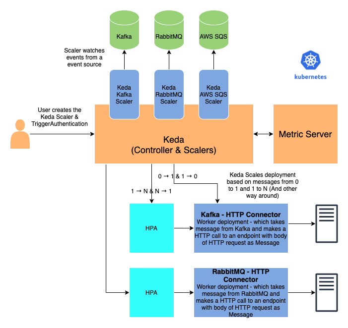

# Keda Connectors

[Keda](https://keda.sh/) is a Kubernetes-based Event Driven Autoscaler which enables you to scale containers for processing events based on number of events. Keda watches the source of events such as a Message Queue with "Scalers". Once the events start coming in, Keda scales a deployment (Worker POD) from 0 to 1 and uses HPA to scale from 1 to N. Once messages are consumed, Keda can also scale back the deployments to 1 and 0.

The deployment that Keda scales can be a custom program you write to do something with message or if your goal is to do something generic as calling a HTTP Server with message content as request body then you can use Keda Connectors. Keda Connectors provide you readymade generic images to process events for standard tasks and send them to a standard set of destinations. For example if you are going to read messages from RabbitMQ and then call an HTTP endpoint then you can use [RabbitMQ HTTP Connector](./rabbitmq-http-connector/README.md). You just have to create a standard deployment manifest with all env variables needed for that deployment/pod. Following diagram shows a sample of Keda with kafka-http-connector and rabbitmq-http-connector.

# Current Connector List

|Connectot Name | Description |
|---|---|
|[AWS SQS HTTP Connector](./aws-sqs-http-connector/README.md)|Reads message from AWS SQS and posts to a HTTP endpoint.|
|[Kafka HTTP Connector](./kafka-http-connector/README.md)| Consumes messages from Kafka topics and posts the message to an HTTP endpoint.|
|[RabbitMQ HTTP Connector](./rabbitmq-http-connector/README.md)|Reads message from RabbitMQ and posts to a HTTP endpoint. Currently only the AMQP protocol is supported for consuming RabbitMQ messages.|

# Contributing

If you want to contribute please checkout the [contributing guide](CONTRIBUTING.md)

# Resources

* An example of kafka-http-connector being used with Fission and Keda is explained here. Though there is context of Fission in blog, the connector used is same generic connector:  https://blog.fission.io/posts/event-driven-scaling-fission-function-using-keda/ 
